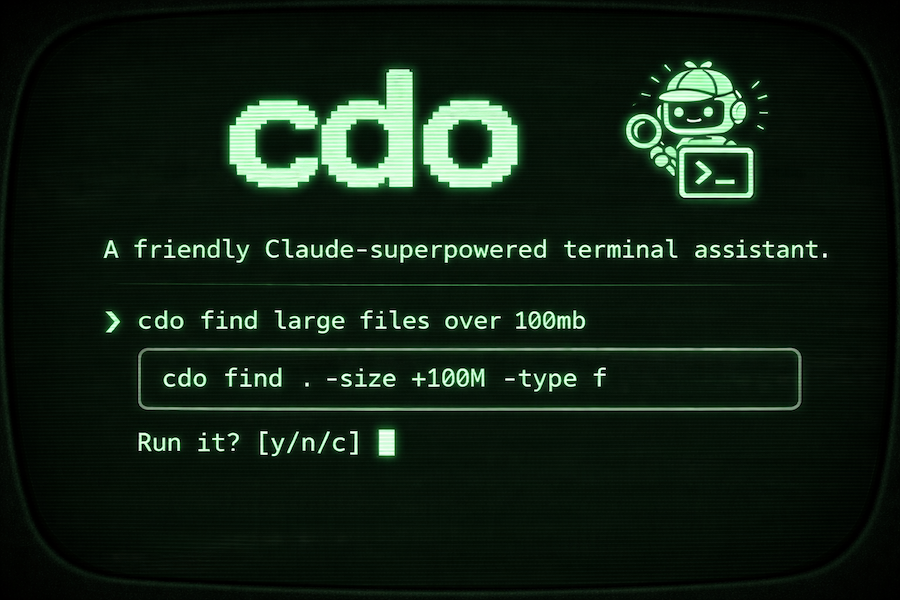

# cdo - Claude-do



A friendly Claude-superpowered terminal assistant. Describe what you want to do in plain English — cdo generates the shell command and asks before running it.

## Who is this for?

Sometimes you just need that one command you can never quite remember — the right `find` flags, how to rebase interactively, or what the `tar` extraction syntax is. You don't want to open a browser, start a Claude Code session, switch models, or deal with configured permissions. You just want the command, right now, in your terminal.

cdo is for:

- **Shell learners** — explore what commands exist and how they work without leaving the terminal
- **Tool learners** — learning git, ffmpeg, docker, or any CLI tool? ask in plain English and see the exact syntax
- **Anyone who forgets syntax** — stop context-switching; stay in the terminal and keep your flow

cdo skips the overhead and gets straight to the point.

## Wait, doesn't this already exist?

Apparently not. Every similar tool I found requires a model provider API key — meaning you need a separate paid account and must manage credentials yourself. None of them work with your existing Claude Code subscription out of the box.

I created cdo because despite my best efforts I failed to find a tool that does what I want: a zero-config, no-API-key-needed terminal assistant that just works if you already have Claude Code installed.

## Prerequisites

- macOS with zsh
- [Claude CLI](https://github.com/anthropics/claude-code) installed and authenticated

## Install

```bash
bash <(curl -fsSL https://raw.githubusercontent.com/sirknigget/cdo/main/scripts/install.sh)
```

This installs the `cdo` script to `~/.local/bin`. Make sure that directory is in your `PATH`.

## Usage

```
cdo <describe what you want to do>
cdo                                   (interactive mode)
```

**Examples:**

```bash
cdo find all python files modified in the last week
cdo show disk usage sorted by size
cdo kill the process using port 3000
cdo compress all jpg files in this folder
```

If your request contains special shell characters (`>`, `|`, `&`, `!`, etc.), wrap it in double quotes to prevent the shell from interpreting them:

```bash
cdo "find files > 100mb"
cdo "list running processes | grep node"
```

Alternatively, run `cdo` with no arguments to enter interactive mode — it prompts you for your request directly, so no quoting is needed:

```
$ cdo
cdo> find files larger than 100mb
```

cdo will show you the generated command and prompt for confirmation:

```
$ cdo find large files over 100mb

  find . -size +100M -type f

Run it? [y/n/c] (c = copy to clipboard):
```

- `y` — execute the command
- `c` — copy to clipboard without executing
- `n` / anything else — cancel

## How it works

1. Your description is sent to Claude Haiku with a strict system prompt instructing it to return only a raw shell command
2. cdo strips any markdown formatting from the response
3. You see the command and choose what to do with it
4. If a clarification is returned, it is shown and cdo exits (conversation history is currently not supported)

## License

MIT
